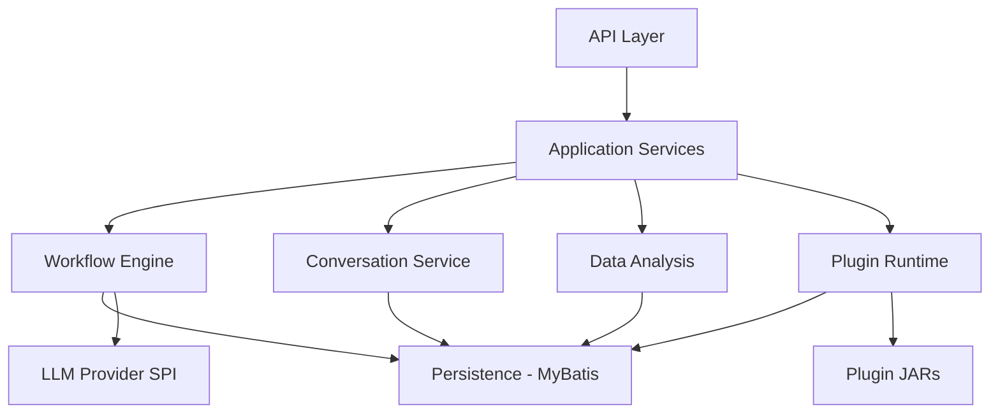
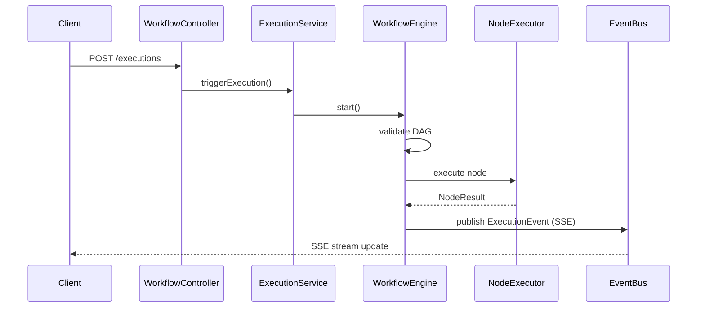
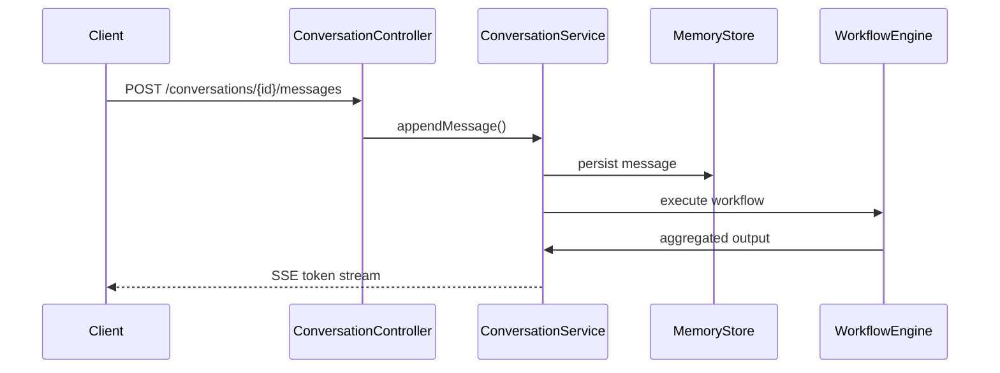
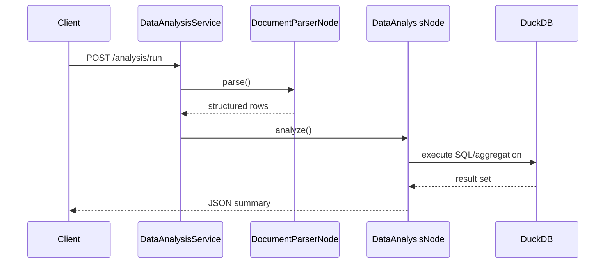

# Agent Platform Backend

## Architecture Overview


The project follows a clean, hexagonal-inspired layering strategy:

- **Interface Layer**: Spring WebFlux controllers that expose OpenAPI-documented REST endpoints and SSE streams.
- **Application Layer**: Orchestrates use cases, workflow execution, conversation handling, data analysis coordination, and plugin lifecycle management.
- **Domain Layer**: Contains workflow DAG models, execution context, node executors (including built-in document parsing and data analysis nodes), and SPI contracts for pluggable extensions and LLM providers.
- **Infrastructure Layer**: MyBatis repositories, Flyway migrations, Testcontainers-based integration tests, plugin scanning, and external integrations (DuckDB, Apache Tika, SSE event bus, etc.).

## Layered Design
| Layer | Responsibilities |
|-------|------------------|
| interface | REST/SSE endpoints, request validation, API response shaping |
| application | Transactional services, business orchestration, workflow scheduling |
| domain | Core models, execution engine, node lifecycle, retry/timeout policy |
| infrastructure | Persistence, external systems, plugin loading, configuration |

## Sequence Diagrams

### Workflow Execution


### Conversation Memory


### Data Analysis Node


## Plugin Mechanism

Plugins use a manifest (`plugin-manifest.json`) that declares metadata, config schema, and entry-point class implementing `com.example.agentplatform.plugin.NodePlugin`. The platform scans `/plugins` on startup or on-demand via the admin API, loads plugin JARs with an isolated class loader, and registers available node executors. An example plugin (`CsvStatsNode`) performs CSV statistics (count, mean, topK) and can be enabled or disabled dynamically.

### Plugin Installation Flow
1. Drop plugin JAR with manifest into `/plugins` directory.
2. Call `POST /admin/plugins/scan` to refresh the registry.
3. Enable plugin via `PUT /admin/plugins/{id}/enable`.
4. Use new node type inside workflow definitions.

## LLM Configuration

Model configurations are managed via the admin API. Each entry references a provider SPI implementation (e.g., `deepseek`). Sensitive API keys are stored as environment variables keyed by the configured alias. Example:

```json
{
  "provider": "deepseek",
  "modelName": "deepseek-chat",
  "baseUrl": "https://api.deepseek.com/v1",
  "apiKeyAlias": "deepseek_primary",
  "timeoutMs": 30000,
  "maxTokens": 2048
}
```

At runtime the platform resolves `deepseek_primary` to the environment variable `DEEPSEEK_PRIMARY_API_KEY`. Logs redact keys to show only the first six and last four characters.

## Getting Started

1. **Requirements**: Java 21, Docker, Docker Compose, Maven 3.9+.
2. **Environment**: set the following variables before startup:
   - `DEEPSEEK_PRIMARY_API_KEY=sk-test-xxxx`
   - `AGENT_PLATFORM_DB_URL=jdbc:mysql://localhost:3306/agent_platform`
   - `AGENT_PLATFORM_DB_USER=root`
   - `AGENT_PLATFORM_DB_PASSWORD=secret`
3. **Run Tests**:
   ```bash
   mvn -DskipTests=false verify
   ```
4. **Start Application**:
   ```bash
   mvn spring-boot:run
   ```
5. **Sample cURL**:
   - Create workflow: `curl -X POST http://localhost:8080/workflows -d @examples/workflow.json -H 'Content-Type: application/json'`
   - Publish workflow: `curl -X POST http://localhost:8080/workflows/{id}/publish`
   - Execute workflow: `curl -X POST http://localhost:8080/executions -d '{"workflowId":1}' -H 'Content-Type: application/json'`
   - Stream events: `curl -N http://localhost:8080/executions/{id}/events`

## Verification Flows

Sample `.http` scripts under `examples/flows.http` cover:
1. CSV Statistical Analysis Flow.
2. Document Key Point Extraction Flow.
3. Plugin CsvStatsNode Flow with conditional branching.

Each script uploads sample datasets, triggers workflow executions, and validates SSE outputs.

